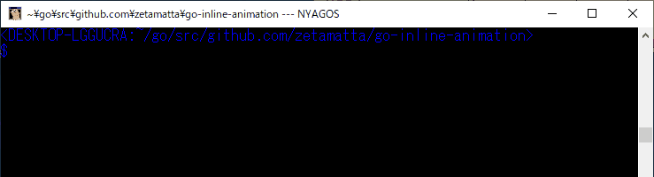

go-inline-animation
===================



example:

```go
// +build run

package main

import (
    "fmt"
    "time"

    "github.com/zetamatta/go-inline-animation"
)

func main() {
    fmt.Print("Test:")

    end := animation.Progress()
    defer end()

    // You can write a time-consuming process instead of Sleep.
    time.Sleep(time.Second * 10)
}
```

```go
// +build run

package main

import (
    "fmt"
    "os"
    "time"

    "github.com/zetamatta/go-inline-animation"
)

func main() {
    fmt.Print("Test:")

    end := animation.Animation{
        Frame: []string{"(^_^)", "(-_-)"},
        Width: 5,
    }.Progress(os.Stdout)

    defer end()

    // You can write a time-consuming process instead of Sleep.
    time.Sleep(time.Second * 10)
}
```
